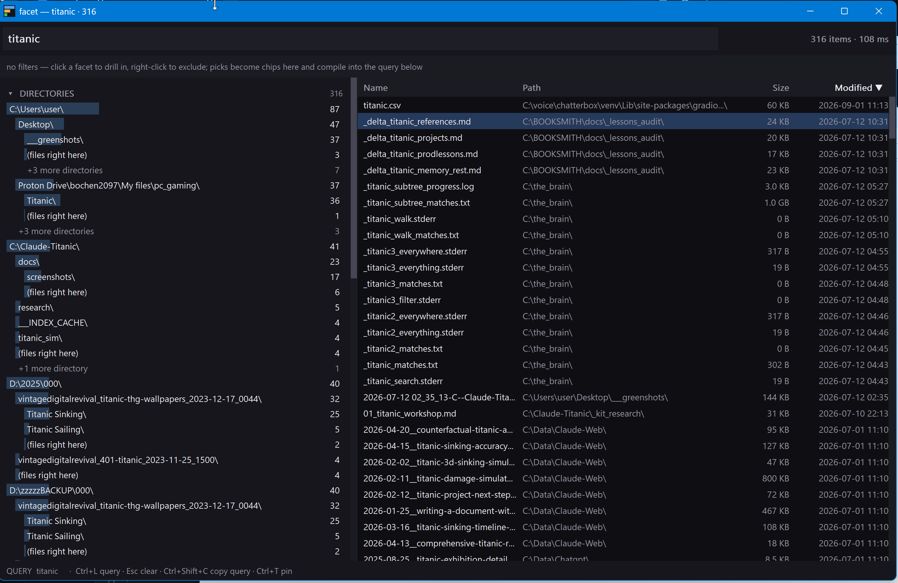

# facet — pivot filtering over Everything's index

**Everything answers *which* files match. facet answers *where they went* — the distribution of a
result set by directory (a tree with counts), extension, modified date, size, and write burst —
and every pick compiles back into Everything syntax, so the query you paste is the query that
produced the numbers.**

The problem it removes, measured on the reference box: 7.1 million items indexed;
`ext:md dm:last3days` finds 3,811; sorted by date you page past directories only an application
would write to, and you cannot see what to exclude until you have scrolled through it. Only 173
of those hits were under `AppData`. 2,797 of them landed in **one second** under a single repo
clone. A static exclude list cannot track that — the noise is a different directory every week —
but a facet computed from the live result set can, and *files per minute* turns out to be a
provenance signal Everything does not have: thousands in a minute is a clone or extract, a dozen
is an agent session, one or two is a hand.

Single ~0.5 MB exe. C/C++ only, OS APIs only, zero dependencies, no installer, no elevation, no
DLL. The index stays Everything's: facet speaks its WM_COPYDATA IPC (the channel `es.exe` uses),
streams the result in pages, and folds them into facets with bounded memory.



## Use

```
facet ext:md dm:last3days              the report: directories · extensions · modified · size · bursts · the query
facet -x C:\deepseek-harness-master ext:md dm:last3days     drop a subtree      → !path:"C:\deepseek-harness-master\"
facet -i C:\NEW --since 12h ext:md                          drill in + a window → path:"C:\NEW\" dm:last720mins
facet --flat 2 ""                      every item on every volume, ranked by drive\folder (7.1 M items in ~10 s)
facet -l -n 50 ext:md dm:today         rows, newest first  ·  -ll adds size + date  ·  -s size|name|path|ext  ·  -a
facet -c ext:md                        count only (37 ms for the whole disk)
facet -j ...                           JSON for agents: the report, rows with -l, the count with -c
facet --grep join ext:md dm:last7days  contains: keep only files whose CONTENTS hold the phrase (everywhere runs over the
                                       result set); the report shows where those files live, rows carry a matches count
facet --gui [query]                    the window: click a facet to drill in, right-click to exclude  ·  facetw.exe = no console
facet --shortcut                       put "facet" in the Start Menu (type facet in Start, pin it from there) · --shortcut desktop
facet --mcp                            MCP stdio server — tools: facet_query, facet_list, facet_count
facet --where                          which Everything.exe facet found, whether it is running, what is indexed
facet --about                          the organ's self-description as JSON: verbs, MCP, health — what `peek env` reads
facet --selftest                       parser, fold, compiler, formatting + live IPC checks
facet --help                           every flag, the JSON shape, exit codes
```

## Everything: found, started, or explained

facet needs the running Everything instance (1.4, or the 1.5 alpha's named instance; both IPC
windows are tried). When none is running, facet looks for `Everything.exe` — the registry's
App Paths and Uninstall keys in both views, Program Files, LocalAppData\Programs, scoop,
chocolatey, PATH, or `--everything-exe PATH` / `FACET_EVERYTHING=PATH` for portable copies —
starts it with `-startup` (tray only, no window), waits for its IPC window and for the database
to load, says so on stderr, and carries on. `--no-start` disables that. When no `Everything.exe`
exists at all, facet prints what Everything is, where to get it (https://www.voidtools.com/downloads/)
and what to do; with `-j` the same text sits in `error`, so an agent can relay it verbatim.
`facet --where` shows both answers on demand.

`<query>` is Everything syntax, verbatim — `ext:md dm:today`, `path:C:\NEW\`, `size:>1mb`,
`!draft`, `a|b`, `"exact phrase"`, `regex:^foo` — anything Everything accepts. Empty = every item.

## Reading the report

```
facet 0.1.0  ext:md dm:last3days
3,812 items · 3,812 files · 0 folders · 79 MB · Everything 1.4.1.1026 · 29 ms

DIRECTORIES                                                    items  share      bytes
 C:\deepseek-harness-master\               █████████░░░       2,841  74.5%      21 MB
   .agents\                                █████░░░░░░░       1,682  44.1%      12 MB
     notes\                                █████░░░░░░░       1,658  43.5%      11 MB
   packages\                               ██░░░░░░░░░░         620  16.3%     4.6 MB
   (files right here)                                             13
   +7 more directories                                            91
 C:\Users\user\                            █░░░░░░░░░░░         218   5.7%     3.6 MB
   AppData\Local\                          █░░░░░░░░░░░         173   4.5%     3.4 MB
 ...
 MODIFIED                          SIZE                          EXTENSIONS
 today            683  17.9%       1 B - 4 KB     1,253  32.9%   .md      3,812  100%
 yesterday        273   7.2%       4 KB - 64 KB   2,409  63.2%
 2 - 7 days ago 2,856  74.9%       ...

WRITE BURSTS  files landing within 60 s of each other
   2,797  2026-08-30 08:37:53 -> 08:37:53 C:\deepseek-harness-master\  >  .agents\ 59%  ·  packages\ 22%  ·  docs\ 8%
      82  2026-09-01 03:00:15 -> 03:00:39 D:\ClaudeCodeBackups\readable\  >  C--greenfield\ 47%  ·  ...
  hand-paced: 198 files in 161 bursts of 1-2  ·  252 bursts in all  ·  last hour: 9 items

QUERY  ext:md dm:last3days
```

- **DIRECTORIES** — where the matches live, ranked across drives (drive + first folder are the
  top entries; a lone `C:\ 100%` line says nothing). A chain such as `C:\Users\user\` collapses
  into one label when every level has nothing of its own. *(files right here)* are items sitting
  directly in that folder; directories below the fold (1 % of the result set, or `--min N`) are
  summed into *+N more*. `--depth` sets how far the tree opens, `--top` how many per level,
  `--flat N` ranks bare prefixes at depth N instead.
- **MODIFIED / SIZE / EXTENSIONS** — fixed buckets with counts and shares. Each bucket carries the
  Everything term that selects exactly it (`dm:today`, `dm:2026-08-25..2026-08-30`,
  `size:4096..65535`, `ext:md`); `-j` prints them, `--selftest` verifies them against Everything.
- **WRITE BURSTS** — every dated item, sorted by modified time and split wherever the silence
  exceeds `--burst-gap` (60 s). For each of the biggest bursts: when, how many, and where — the
  deepest directory holding ≥ 90 % of it, and where that splits, the biggest pieces below it.
  Each burst compiles to `dm:START..END` at second precision (`-j` prints it). The footer
  counts the hand-paced tail: bursts of one or two files.
- **QUERY** — the compiled Everything query. Every `-x` / `-i` / `-e` / `--since` / `--files` is
  in it; paste it into Everything's search box or into `search.py`.

## The window

`facet --gui [query]`, double-click `facetw.exe`, or type *facet* in the Start Menu after `facet --shortcut` — the same engine with a rail you click:

- **Query box** — Everything syntax, verbatim; the search re-runs as you type (260 ms after the
  last key), Enter runs it now.
- **Contains box** (Ctrl+K) — a phrase; `everywhere` scans the current result set's files for it
  and only the files that hold it stay: the rail shows where *those* live, the table gains a
  **Hits** column (matching lines per file, sortable), the tally reads "57 of 1,255 files contain
  it · 3.2 s", and Ctrl+Shift+C copies the equivalent shell pipeline. Literal and case-insensitive;
  the CLI's `--grep-regex` / `--grep-case` apply when the window is started with them. Above
  `--scan-max` files (1,000,000) it refuses and asks you to narrow the query first.
- **Facet rail** — the report's sections, live. Left-click a directory, extension, bucket or
  burst to keep only it; right-click to exclude it (*(files right here)* rows select the files
  directly inside a folder, through Everything's `parent:`). Each pick becomes a **chip**; the chips
  compile into the query in the status line and the whole thing is re-run through Everything,
  so every count is Everything's. `×` removes a chip, Esc clears them all. Right-click a `not …`
  chip to pin it as a standing exclude: it is kept in `facet.ini` next to the exe and applied on
  every launch — the noise list that keeps itself (`--ini PATH` keeps a second profile). Section headers fold and unfold.
- **Results** — the rows, newest first; click a column to sort (Everything sorts, the list is
  re-fetched); double-click or Enter opens a row; Delete excludes the selected row's folder;
  Ctrl+C copies the path. **Right-click any cell** and the column decides what "this" means:
  the *path* cell offers *only* / *not* for every folder level from the file's own folder up to
  the drive, plus the files directly in it; the *name* cell the exact name (`wfn:`) and the
  extension; the *size* cell the exact size, "this and larger", "this and smaller", and the
  size bucket; the *modified* cell the day, the minute, "this and newer", "this and older".
  Every entry shows the Everything term it adds, and it lands as a chip like any other pick.
- Keys: Ctrl+L query · Esc clear filters · F5 rerun · Ctrl+Shift+C copy the compiled query ·
  Ctrl+T pin on top.
- `--shot FILE.png` renders the window once, saves it and exits — [docs/screenshot.png](docs/screenshot.png)
  was taken that way, no hands.

Everything streams on a worker thread with its own IPC window; the tally counts up while a long
pass runs (the whole disk takes ~10 s), and a new keystroke cancels the pass in flight at its
next page. Up to 200,000 rows are kept for the table; the facets always cover the whole result
set unless the window was started with `-n`.

## The numbers, honestly

- Counts are Everything's: the compiled query is sent to the running instance and every result
  is streamed back — facet never re-implements matching, so `facet -c Q` equals Everything's
  status bar for `Q`. Excludes/includes compile to `path:"DIR\"`; the trailing separator is what
  makes it a subtree test (`C:\NEW\` cannot match `C:\NEWER\`).
- facet requests name, path, size and date-modified only. Size and date-modified are indexed on
  the reference box; date-created is not, and asking for an unindexed property makes Everything
  read it from disk per row — so facet never asks.
- Folders carry no size (folder-size indexing is off); they count as items, sit in the
  *folders / no size* bucket, and are excluded from byte totals.
- Modified buckets use local calendar days; *today* / *yesterday* compile to Everything's own
  constants, the rest to absolute `dm:A..B` ranges; ranges are inclusive at day and at second
  precision (measured). Everything 1.4 spells relative windows in the plural — `last3days`,
  `last720mins` — so `--since 12h` compiles to minutes and `--since 2w` to days.
- Bursts are clusters of modified times, not process attribution: a burst tells you *something*
  wrote N files in that window and where; the directory usually says what.
- Peak memory is proportional to the result set: ~460 MB for all 7.1 M items on the reference
  box (one 16-byte event per dated item plus the directory trie), a few MB for a typical query.

## Agents

```bash
facet -j "ext:md dm:today"                       where today's markdown went, by directory
facet -j --flat 2 --since 1h ""                  what wrote to the disk in the last hour
facet -l -j -n 50 -x C:\deepseek-harness-master "ext:md dm:today"
facet -c "ext:pdf size:>10mb"                    the cheapest probe
claude mcp add facet -- C:/facet/facet.exe --mcp # tools: facet_query, facet_list, facet_count
```

JSON shape (single line, stable field names): `{tool,version,query,compiled,everything,total,
scanned,files,folders,bytes,unknown_size,last_hour,elapsed_ms,error, directories[{path,count,
share,bytes,files_here,children[...],more{directories,items}}], extensions[{ext,count,share,
bytes}], modified[{bucket,query,count,bytes}], size[{bucket,query,count,bytes}], bursts[{start,
end,seconds,count,dir,dir_share,parts[{dir,share}],query}], bursts_total, handpaced{bursts,
files}, burst_gap_s}`. Every bucket's / burst's `query` is the Everything term selecting it;
append it to `compiled` to drill in. Exit codes: 0 ok · 1 bad arguments · 2 Everything
unreachable / IPC error (JSON still emitted with `error`) · 3 selftest failed.

## Speed (reference box: 7.1 M items indexed, Everything 1.4.1.1026, i9-9900K)

| query                     | items      | wall      |
|---------------------------|-----------:|----------:|
| `-c` anything             | —          | ~40 ms    |
| `ext:md dm:last3days`     | 3,812      | ~30 ms    |
| `ext:md dm:last7days`     | 382,307    | ~380 ms   |
| `""` (every item)         | 7,135,216  | ~10 s     |

The whole-disk pass is bounded by Everything formatting 7.1 M rows into IPC pages, not by the
fold (`--page 262144` shaves ~5 %; 65,536 is the default for its smaller working set).

## Build

```
build.bat     # VS2022: cl /std:c++20 /O2 /W4 /permissive- /utf-8 /MT → facet.exe + facetw.exe
```

Files: `everything_ipc.h` (the IPC contract: QUERY2 / LIST2 / ITEM2, request flags, sorts) ·
`es_client.h/.cpp` (the collector: reply window, paging, parser; OS glue) · `facets.h/.cpp` (the
fold: directory trie, extensions, buckets, bursts, retained rows) · `query.h` (the compiler:
picks → Everything syntax) · `app_util.h` (options, formatting, Unicode-width columns) ·
`facet.cpp` (report, list, count, JSON, MCP, where, selftest) · `facet_gui.cpp` (the window,
the icon, the shortcut) · `facet.ico` (exported by `facet --make-icon`, embedded by the .rc) ·
`facet.rc` + `facet.manifest` (icon, version info, PerMonitorV2 DPI, UTF-8 code page, long paths) ·
`docs/devlog.md` (decisions and measurements as they happened).

## Known limits

- Everything must be installed; the service alone has no IPC window, so facet starts the tray
  instance itself when needed (see above) and exits 2 with the install hint otherwise.
- Everything 1.4 answers one page per WM_COPYDATA; facet streams pages of `--page` items
  (65,536). The database is live, so two passes seconds apart can differ by a few items.
- *in the future* and *no date* buckets have no query term; Everything 1.4 has no `dm:` form
  for "unknown".
- Windows only, by construction — the whole point is the WDDM-era MFT index Everything keeps.

## Contains: everywhere inside facet

`--grep PHRASE` (window: the contains box) runs the whole names → contents → where pipeline in
one pass: Everything narrows by name and date, every file of the result set is handed to
`everywhere.exe` on a pipe, and only the hits are folded — with a matches count per file. The
report says `contains "join": 52 of 382,529 files, 118 matches · everywhere 4.1 s` and prints
the shell form it is equivalent to; `-j` carries the same under `grep`, `-l` / `-ll` rows carry
`matches`, `--paths --grep` prints only the hits, `-c --grep` counts them. facet finds
`everywhere.exe` next to itself, in `C:\everywhere\build\Release`, in Program Files or on PATH
(`--everywhere-exe PATH` / `FACET_EVERYWHERE` otherwise) and explains what is missing when none
exists; everything else keeps working without it.

## Tapes: the pipe between everything, everywhere and everywhen

A **tape** is a list of full paths — one per line (LF, CRLF or NUL-separated), or JSONL whose
objects carry `path` or `file`. facet writes one with `--paths` and reads one with
`--files-from`; `C:\everywhere` reads one with `--files-from -` and writes one with `-l` or
`--jsonl`; `C:\everywhen` writes one with `search --paths` and resolves `path:line` back to a
message with `locate`. Same syntax everywhere, so the three compose in a shell:

```
facet --paths <query>                 the result set as a tape, streamed (no facets computed)
facet --files-from F|- [report opts]  fold a tape instead of a query: one stat per path, missing
                                      files counted, duplicates and comments dropped
--and F   --or F   --not F            set algebra: (base ∩ and…) ∪ or… − not…   (repeatable)
-0                                    NUL-separated paths out; input is auto-detected
```

```bash
# names → contents → where: last week's markdown minus the vendored repo, scanned for "join", folded by directory
facet --paths -x C:\deepseek-harness-master ext:md dm:last7days | everywhere --files-from - -e join -l | facet --files-from -

# sessions → tapes → contents → messages: sessions that talked about facet and also say vramtop, resolved to the message
everywhen search --hours 720 --query facet --paths | everywhere --files-from - -e vramtop --jsonl | everywhen locate - --json

# contents → where: every file holding a key, by directory and write burst
everywhere -l "API_KEY" C:\Data | facet --files-from -

# algebra: today's markdown that Everything knows, minus a noise tape; or two tapes united
facet -c ext:md dm:today --not noise.txt        facet --paths --files-from a.txt --or b.txt
```

Measured: `facet --paths` streams 382,529 paths in under a second; folding a 300-path tape takes
3 ms; everywhere needed about four minutes to scan those 382k small files cold, so look at
facet's tally (files, bytes) before you hand a tape to a content scan. The full design, the
shapes considered, and what comes next are in [docs/trilogy.md](docs/trilogy.md).

## Why Everything itself does not do this

Everything's query language always combined filters (`ext:md dm:last3days !path:"C:\x\"` has
worked for years) and 1.5 adds multi-column sort — but the UI never shows the *shape* of a result
set, so you can only exclude what you already know to exclude, and you learn that by paging past
it. Faceted navigation is the standard answer (every search engine's left rail); nobody had put
one on Everything's index. facet is that rail, headless first so agents get it too.
